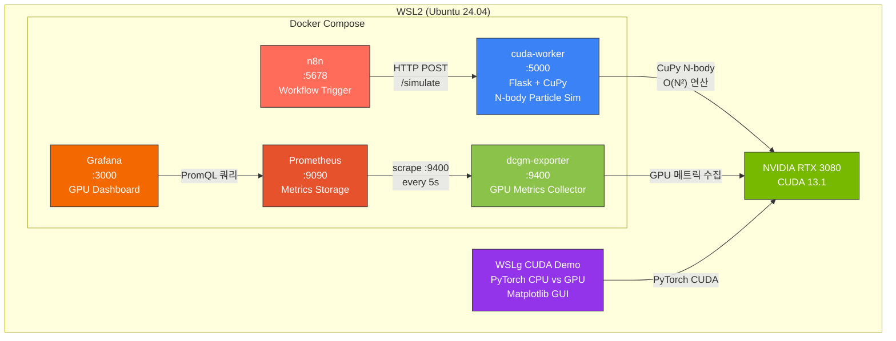
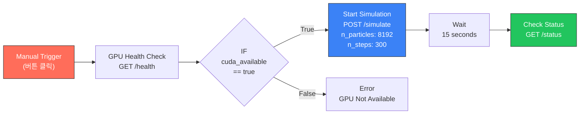
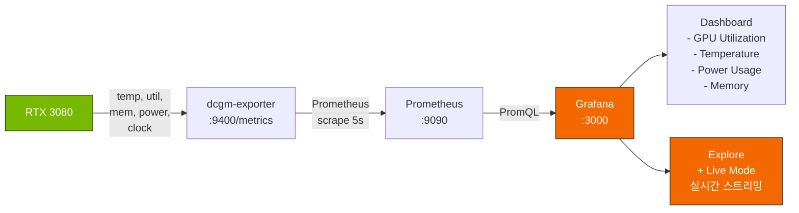

# WSL2 + CUDA 13.1 + Docker 환경 구성

> n8n 워크플로우 트리거 → CuPy 파티클 시뮬레이션 → Grafana GPU 실시간 모니터링 + WSLg CUDA 시연

---

## 환경 정보

| 항목 | 버전 |
|------|------|
| OS (호스트) | Windows 11 + WSL2 |
| WSL 배포판 | Ubuntu 24.04 |
| CUDA Toolkit | 13.1 |
| GPU | NVIDIA GeForce RTX 3080 |
| Driver | 591.86 |
| Docker | Docker Desktop (WSL2 backend) |

---

## 시스템 아키텍처



---

## n8n 워크플로우



---

## 모니터링 파이프라인



---

## 프로젝트 구조

```
cuda-docker-project/
├── docker-compose.yml          # 5개 서비스 정의
├── prometheus.yml              # Prometheus scrape 설정
├── cuda-worker/
│   ├── Dockerfile              # CUDA 13.1 + Ubuntu 24.04 + CuPy
│   └── app.py                  # Flask API + N-body 파티클 시뮬레이션
├── grafana/
│   ├── provisioning/
│   │   ├── datasources/
│   │   │   └── prometheus.yml  # Prometheus 데이터소스 자동 등록
│   │   └── dashboards/
│   │       └── default.yml     # 대시보드 프로비저닝 설정
│   └── dashboards/
│       └── gpu-dashboard.json  # GPU 모니터링 대시보드
├── cuda_wslg_demo.py           # WSLg CUDA 시연 (PyTorch GUI)
├── .gitignore
└── README.md
```

---

## 서비스 구성

| 서비스 | 포트 | 이미지 | 역할 |
|--------|------|--------|------|
| n8n | 5678 | `n8nio/n8n` | 워크플로우 자동화 (시뮬레이션 트리거) |
| cuda-worker | 5000 | `nvidia/cuda:13.1.0-devel-ubuntu24.04` + Flask + CuPy | N-body 파티클 시뮬레이션 API |
| dcgm-exporter | 9400 | `nvcr.io/nvidia/k8s/dcgm-exporter` | GPU 메트릭 수집 (온도/사용률/전력/메모리) |
| Prometheus | 9090 | `prom/prometheus` | 메트릭 시계열 저장소 |
| Grafana | 3000 | `grafana/grafana` | GPU 모니터링 대시보드 & Explore |

---

## 실행 방법

### 1. Docker 서비스 기동

```bash
cd cuda-docker-project
docker compose up -d --build
docker ps  # 5개 컨테이너 running 확인
```

### 2. n8n 워크플로우 실행

1. `http://localhost:5678` 접속 (admin / admin)
2. 워크플로우 구성: Manual Trigger → Health Check → IF → Simulate → Wait → Status
3. **Execute Workflow** 클릭 → CuPy 파티클 시뮬레이션 트리거

### 3. Grafana GPU 모니터링 확인

1. `http://localhost:3000` 접속 (admin / admin)
2. NVIDIA DCGM Exporter Dashboard (ID: 12239) import
3. 또는 **Explore** → `DCGM_FI_DEV_GPU_UTIL` → **Live** 모드로 실시간 확인
4. n8n 시뮬레이션 실행 시 GPU 사용률/온도/전력 그래프 변화 확인

### 4. WSLg CUDA 시연

```bash
# venv 생성 및 활성화 (Ubuntu 24.04)
sudo apt install -y python3-venv python3-tk
python3 -m venv ~/cuda-venv
source ~/cuda-venv/bin/activate

# 패키지 설치 및 실행
pip install torch matplotlib
python3 cuda_wslg_demo.py
```

WSLg를 통해 Windows 바탕화면에 CPU vs GPU 벤치마크 GUI 창이 표시됩니다.

---

## CuPy 파티클 시뮬레이션 API

| Endpoint | Method | 설명 |
|----------|--------|------|
| `/health` | GET | GPU 상태 확인 (이름, 메모리, CUDA 버전) |
| `/simulate` | POST | 파티클 시뮬레이션 시작 (비동기) |
| `/status` | GET | 현재 시뮬레이션 진행률 및 결과 |

### 부하 강도 조절 (POST /simulate Body)

```json
{ "n_particles": 8192, "n_steps": 300 }
```

| n_particles | n_steps | 부하 수준 | 비고 |
|------------|---------|----------|------|
| 2048 | 100 | 가벼움 | 빠른 테스트 |
| 8192 | 300 | 중간 | 영상 시연 추천 |
| 16384 | 500 | 무거움 | Grafana 극적 변화 |

> N-body 계산은 O(N²)이므로 n_particles가 2배 → 연산량 4배

---

## 시연 영상

[recording.mp4](./recording.mp4)
