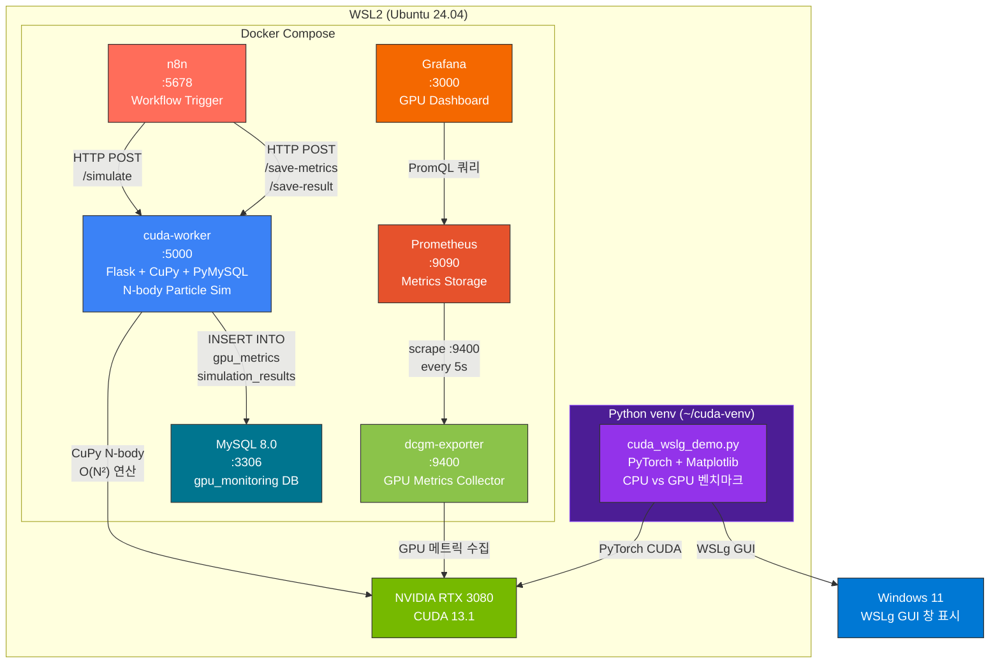
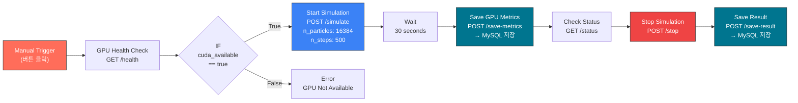
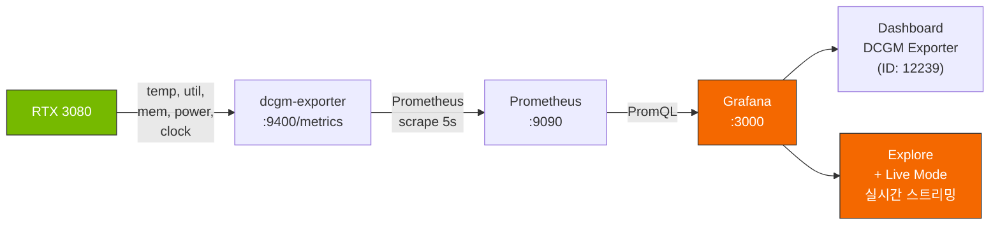
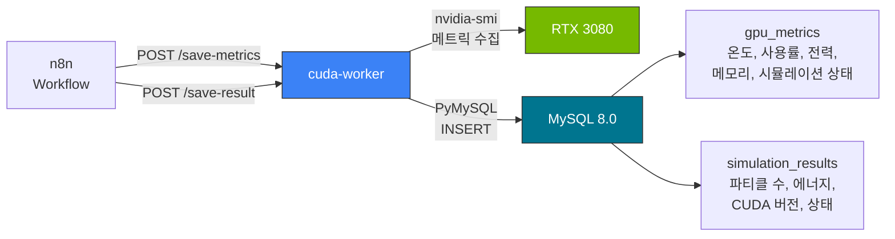
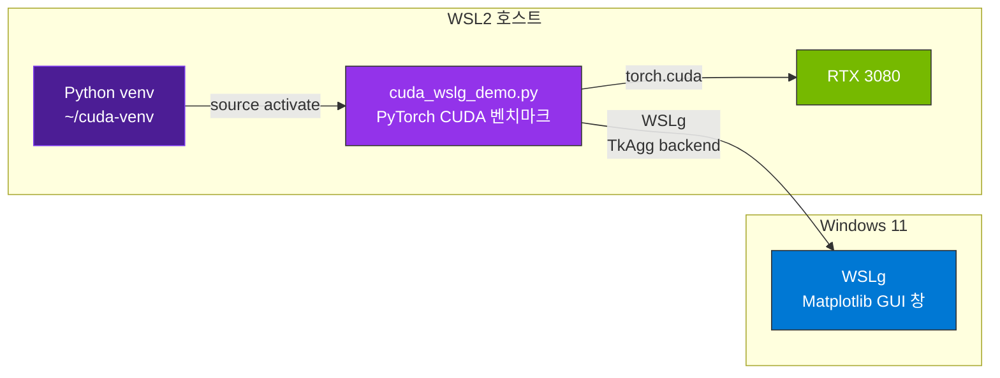

# WSL2 + CUDA 13.1 + Docker 환경 구성

> n8n 워크플로우 트리거 → CuPy 파티클 시뮬레이션 → Grafana GPU 실시간 모니터링 → MySQL 메트릭 저장 + WSLg CUDA 시연

---

## 환경 정보

| 항목 | 버전 |
|------|------|
| OS (호스트) | Windows 11 + WSL2 |
| WSL 배포판 | Ubuntu 24.04 |
| CUDA Toolkit | 13.1 |
| GPU | NVIDIA GeForce RTX 3080 |
| Driver | 591.86 |
| Docker | Docker Desktop (WSL2 backend) |

---

## 시스템 아키텍처



---

## n8n 워크플로우



---

## 모니터링 파이프라인



---

## 데이터 저장 파이프라인



---

## WSLg 시연 환경

WSLg 환경 검증을 위해 Docker 외부에 별도 Python 가상환경(venv)을 구성했습니다.
Ubuntu 24.04에서는 시스템 Python에 직접 pip 설치가 제한(PEP 668)되어 있어 venv를 통해 PyTorch, Matplotlib을 설치했습니다.



### venv 세팅 방법

```bash
sudo apt install -y python3-venv python3-tk
python3 -m venv ~/cuda-venv
source ~/cuda-venv/bin/activate
pip install torch matplotlib
python3 cuda_wslg_demo.py
```

---

## 프로젝트 구조

```
cuda-docker-project/
├── docker-compose.yml          # 6개 Docker 서비스 정의
├── prometheus.yml              # Prometheus scrape 설정
├── cuda-worker/
│   ├── Dockerfile              # CUDA 13.1 + Ubuntu 24.04 + CuPy + PyMySQL
│   └── app.py                  # Flask API (시뮬레이션 + 메트릭 + MySQL 저장)
├── mysql/
│   └── init/
│       └── 01-init.sql         # gpu_metrics, simulation_results 테이블 생성
├── grafana/
│   ├── provisioning/
│   │   ├── datasources/
│   │   │   └── prometheus.yml  # Prometheus 데이터소스 자동 등록
│   │   └── dashboards/
│   │       └── default.yml     # 대시보드 프로비저닝 설정
│   └── dashboards/
│       └── gpu-dashboard.json  # GPU 모니터링 대시보드
├── cuda_wslg_demo.py           # WSLg CUDA 시연 (venv에서 실행)
├── architecture.mermaid        # 아키텍처 다이어그램
├── .gitignore
└── README.md
```

---

## 서비스 구성

### Docker Compose 서비스 (6개)

| 서비스 | 포트 | 이미지 | 역할 |
|--------|------|--------|------|
| n8n | 5678 | `n8nio/n8n` | 워크플로우 자동화 (시뮬레이션 트리거 + MySQL 저장) |
| cuda-worker | 5000 | `nvidia/cuda:13.1.0-devel-ubuntu24.04` + Flask + CuPy + PyMySQL | 시뮬레이션 API + GPU 메트릭 수집 + MySQL 저장 |
| dcgm-exporter | 9400 | `nvcr.io/nvidia/k8s/dcgm-exporter` | GPU 메트릭 수집 (온도/사용률/전력/메모리) |
| Prometheus | 9090 | `prom/prometheus` | 메트릭 시계열 저장소 |
| Grafana | 3000 | `grafana/grafana` | GPU 모니터링 대시보드 & Explore |
| MySQL | 3306 | `mysql:8.0` | GPU 메트릭 및 시뮬레이션 결과 저장 |

### Docker 외부 (WSLg 시연용)

| 구성 | 경로 | 설명 |
|------|------|------|
| Python venv | `~/cuda-venv` | PyTorch + Matplotlib 설치된 가상환경 |
| 시연 스크립트 | `cuda_wslg_demo.py` | CPU vs GPU 벤치마크 → WSLg GUI 출력 |

---

## 실행 방법

### 1. Docker 서비스 기동

```bash
cd cuda-docker-project
docker compose up -d --build
docker ps  # 6개 컨테이너 running 확인
```

### 2. n8n 워크플로우 실행

1. `http://localhost:5678` 접속 (admin / admin)
2. 워크플로우 Import (My_workflow.json)
3. **Execute Workflow** 클릭 → 시뮬레이션 트리거 → 메트릭/결과 MySQL 저장 → 자동 종료

### 3. Grafana GPU 모니터링 확인

1. `http://localhost:3000` 접속 (admin / admin)
2. NVIDIA DCGM Exporter Dashboard (ID: 12239) import
3. **Explore** → `DCGM_FI_DEV_GPU_TEMP` → **Live** 모드로 실시간 온도 확인
4. n8n 시뮬레이션 실행 시 GPU 사용률/온도/전력 그래프 변화 확인

### 4. MySQL 데이터 확인

```bash
# CLI
docker exec -it $(docker ps -qf "name=mysql") mysql -un8n -pn8n1234 gpu_monitoring
SELECT * FROM gpu_metrics ORDER BY id DESC LIMIT 10;
SELECT * FROM simulation_results ORDER BY id DESC LIMIT 10;
```

VS Code에서 확인: MySQL 확장(by Weijan Chen) 설치 → localhost:3306 / n8n / n8n1234 / gpu_monitoring

### 5. WSLg CUDA 시연 (Docker 외부 venv)

```bash
source ~/cuda-venv/bin/activate
cd ~/cuda-docker-project
python3 cuda_wslg_demo.py
```

---

## cuda-worker API

| Endpoint | Method | 설명 |
|----------|--------|------|
| `/health` | GET | GPU 상태 확인 (이름, 메모리, CUDA 버전) |
| `/simulate` | POST | 파티클 시뮬레이션 시작 (비동기) |
| `/status` | GET | 현재 시뮬레이션 진행률 및 결과 |
| `/stop` | POST | 실행 중인 시뮬레이션 즉시 종료 |
| `/metrics` | GET | GPU 메트릭 조회 (nvidia-smi 기반) |
| `/save-metrics` | POST | GPU 메트릭 수집 → MySQL 저장 |
| `/save-result` | POST | 시뮬레이션 결과 → MySQL 저장 (종료 대기 포함) |

### 부하 강도 조절 (POST /simulate Body)

```json
{ "n_particles": 16384, "n_steps": 500 }
```

| n_particles | n_steps | 부하 수준 | 비고 |
|------------|---------|----------|------|
| 2048 | 100 | 가벼움 | 빠른 테스트 |
| 8192 | 300 | 중간 | 일반 시연 |
| 16384 | 500 | 무거움 | 영상 시연 추천 (Grafana 극적 변화) |

> N-body 계산은 O(N²)이므로 n_particles가 2배 → 연산량 4배

---

## MySQL 테이블 구조

### gpu_metrics

| 컬럼 | 타입 | 설명 |
|------|------|------|
| gpu_name | VARCHAR(100) | GPU 이름 |
| gpu_util | FLOAT | GPU 사용률 (%) |
| mem_used_mb | FLOAT | 메모리 사용량 (MB) |
| mem_total_mb | FLOAT | 메모리 전체 (MB) |
| temperature | FLOAT | GPU 온도 (°C) |
| power_usage | FLOAT | 전력 사용량 (W) |
| simulation_running | BOOLEAN | 시뮬레이션 실행 중 여부 |
| simulation_progress | INT | 시뮬레이션 진행률 (%) |
| timestamp | DATETIME | 저장 시각 |

### simulation_results

| 컬럼 | 타입 | 설명 |
|------|------|------|
| gpu_name | VARCHAR(100) | GPU 이름 |
| n_particles | INT | 파티클 수 |
| n_steps | INT | 시뮬레이션 스텝 수 |
| kinetic_energy | FLOAT | 최종 운동 에너지 |
| gpu_memory_used_mb | INT | GPU 메모리 사용량 |
| cuda_version | VARCHAR(20) | CUDA 런타임 버전 |
| status | VARCHAR(20) | completed / stopped / error |
| timestamp | DATETIME | 저장 시각 |

---

## 시연 영상

[recording.mp4](./recording.mp4)
